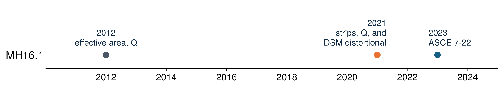
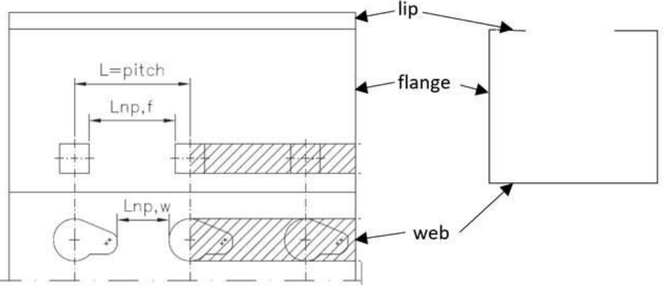
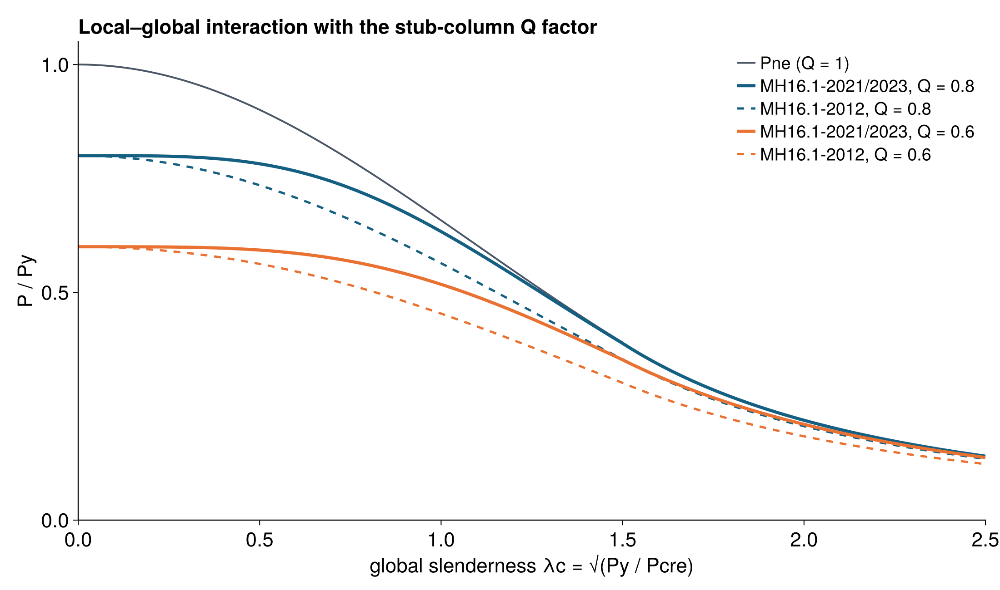
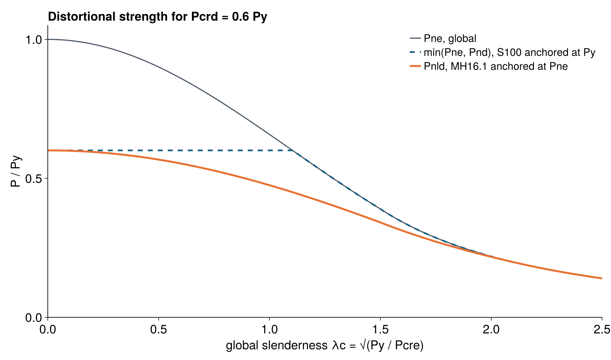
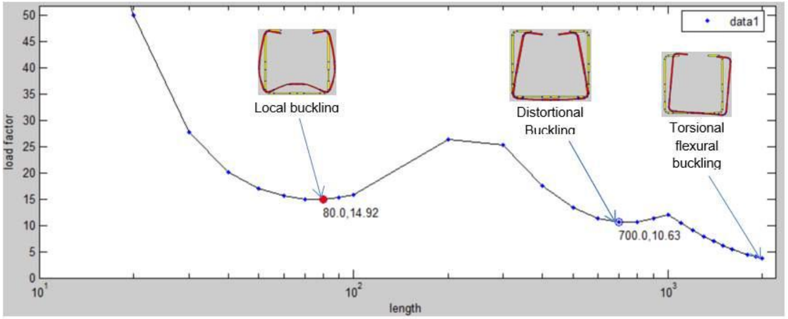

@layout title
# Recent updates to ANSI MH16.1: perforated rack member design and the Direct Strength Method
@kicker Cristopher D. Moen · RunToSolve LLC
@chips Wei-Wen Yu International Specialty Conference on Cold-Formed Steel Structures | Madison, Wisconsin | October 6–7, 2026
@keys runtosolve.github.io/ICCFSS2026_MoenRackStandards · cris.moen@runtosolve.com
@fig svg data/qr.svg

---

@eyebrow Motivation
# Three editions of MH16.1 in eleven years

- **ANSI MH16.1** (RMI) is the specification for industrial steel storage racks, referenced by ASCE 7 §15.5.3 and the IBC
- Rack uprights are roll-formed, thin, open, and **perforated along their full length**, so local, distortional, and global buckling interact
- The 2021 edition rewrote the member design chapter around elastic buckling analysis; the 2023 edition kept it
- This talk: what changed from 2012 to 2023 and where the Direct Strength Method enters
@gap 10

---

@eyebrow MH16.1-2012 baseline
# Effective area and the stub-column Q factor

::: cols
::: panel Compression (§4.1.3.1)
- Effective area from the stub-column test:
  $$A_e = \left[1 - (1 - Q)\left(\frac{F_n}{F_y}\right)^{Q}\right] A_{net\,min}$$
- $P_n = A_e F_n$, with $F_n$ from AISI S100 on the **gross, unperforated** section
- $Q$ = stub column strength / $(F_y A_{net\,min})$ ≤ 1 (§9.2.2)
:::
:: col
::: panel Flexure (§4.1.2)
- $S_e = S_{net\,min}(0.5 + Q/2)$
- Round corners for $A$ and $I$; sharp corners permitted for $J$, $C_w$, $r_o$
:::
@gap 12
::: panel Distortional (§4.1.3.2)
- One sentence: certain open sections "shall be checked … by testing or rational analysis"
- No equations, no elastic buckling load
:::
:::
@gap 12
?> Frame stability by the effective length method: down-aisle $K_x$ = 1.7 for unbraced racks, $K_t$ = 0.8

---

@eyebrow MH16.1-2021 · §8.2.1
# Perforations become reduced-thickness strips

::: cols
- Section properties use **round corners** for everything, including $J$ and $C_w$ (sharp corners are unconservative for torsion)
- Each strip of web or flange that contains perforations is replaced by a solid strip of reduced thickness
- **Global and local** buckling, $k_g$ = 0.6:
  $$t_g = k_g\, t \left(\frac{L_{np}}{L}\right)$$
- **Distortional** buckling, $k_d$ = 0.8:
  $$t_d = k_d\, t \left(\frac{L_{np}}{L}\right)^{1/3}$$
- $L_{np}$ is the solid length between holes, $L$ the pitch
:: col

?> Source: ANSI MH16.1-2023, Figure 8.2-1, example of perforation strips in a column
@gap 14
- One idealized section feeds the frame model (§7.2.4), the global buckling check, and the finite strip model for $P_{crd}$ and $M_{crd}$
:::

---

@eyebrow MH16.1-2021/2023 · §8.2.2
# Perforated compression members

::: cols
::: panel Global (8.2-3, 8.2-4)
$$P_{ne} = \begin{cases} 0.658^{\lambda_c^2} P_y & \lambda_c \le 1.5 \\[2pt] \dfrac{0.877}{\lambda_c^2} P_y & \lambda_c > 1.5\end{cases} \qquad \lambda_c = \sqrt{P_y/P_{cre}}$$
$P_y = F_y A_{netg}$; $P_{cre}$ with $K$, $L$ from §10.2, §10.3
:::
@gap 10
::: panel Local + global (8.2-5, 8.2-6)
$$P_{nlg} = P_{ne}\left[1 - (1 - Q)\left(\frac{P_{ne}}{P_y}\right)^{\frac{Q}{1-Q}}\right], \quad Q < 1$$
$P_{nlg} = P_{ne}$ if $Q \ge 1$ (split out as its own equation in 2023)
:::
:: col
::: panel Distortional + global (8.2-7, 8.2-8)
$$P_{nld} = \left[1 - 0.25\left(\frac{P_{crd}}{P_{ne}}\right)^{0.6}\right]\left(\frac{P_{crd}}{P_{ne}}\right)^{0.6} P_{ne}$$
for $\lambda_d = \sqrt{P_{ne}/P_{crd}} > 0.561$, else $P_{nld} = P_{ne}$
:::
@gap 10
- $P_n = \min(P_{nlg},\, P_{nld})$
- $P_{crd}$: elastic distortional buckling "in accordance with ANSI/AISI S100" on the $t_d$ section
- Hot-rolled and closed sections: $P_{nlg}$ only
:::

---

@eyebrow Local buckling
# Still the stub column, in a new form

::: cols

?> Both forms with $F_n/F_y = P_{ne}/P_y$ on the same area basis. 2012 used $A_{net\,min}$; 2021 uses $A_{netg}$ from the strip section.
:: col
- Local buckling is **not** a DSM check: there is no $P_{cr\ell}$. The perforation and local slenderness effects both come from the **stub-column test** (§13.2.3, $Q = P_{test}/(F_y A_{netg})$ ≤ 1, interpolated between $t_{min}$ and $t_{max}$)
- The 2021 exponent $Q/(1-Q)$ makes the local penalty fade as the column becomes globally slender, the same trend as the DSM local–global curve
- For a given $Q$, the new form is less severe at intermediate $\lambda_c$
:::

---

@eyebrow Distortional buckling
# The Direct Strength Method piece

::: cols
- New in 2021: an explicit distortional check with an elastic buckling load, $P_{crd}$ or $M_{crd}$, the DSM ingredient
- Same 0.25 / 0.6 coefficients and 0.561 limit as the AISI S100 distortional curve, but **anchored at $P_{ne}$ instead of $P_y$**
- That captures distortional–global interaction, which tests and FE studies on perforated uprights showed (Casafont, Pastor, Roure, Bonada, Peköz)
- At $\lambda_c$ = 0 the two agree; at intermediate slenderness MH16.1 is lower, and both reach $P_{ne}$ for slender columns
:: col

?> Example with $P_{crd} = 0.6\,P_y$
:::

---

@eyebrow Distortional buckling
# Finite strip analysis on the strip section

::: cols

?> Source: ANSI MH16.1-2023 Commentary, Figure C8.2-5. CUFSM: local minimum at 80 mm (load factor 14.92), distortional at 700 mm (10.63)
:: col
- Commentary C8: the "most suitable design approach would be to use finite strip analysis combined with the expressions given"
- Workflow
  - build the round-corner section with $t_d$ in the perforated strips
  - run CUFSM (or any S100 Appendix 2 analysis)
  - read $P_{crd}$ at the distortional minimum
  - the same model with $t_g$ gives the global section properties
- Basis: tests, shell FE and FSM studies on perforated uprights (Casafont et al., ASCE *J. Struct. Eng.* 2013, "Design of steel storage rack columns via the Direct Strength Method")
:::

---

@eyebrow MH16.1-2021/2023 · §8.2.3
# Flexure follows the same pattern

::: cols
::: panel Local + global (8.2-9, 8.2-10)
$$M_{nlg} = M_{ne}\left[1 - \tfrac{1}{2}(1 - Q)\left(\frac{M_{ne}}{M_y}\right)^{\frac{Q}{1-Q}}\right], \quad Q < 1$$
$M_y = F_y S_{fy}$, with $S_{fy}$ on the reduced-thickness section
:::
:: col
::: panel Distortional + global (8.2-11, 8.2-12)
$$M_{nld} = \left[1 - 0.22\left(\frac{M_{crd}}{M_{ne}}\right)^{0.5}\right]\left(\frac{M_{crd}}{M_{ne}}\right)^{0.5} M_{ne}$$
for $\lambda_d = \sqrt{M_{ne}/M_{crd}} > 0.673$, else $M_{nld} = M_{ne}$
:::
:::
@gap 14
- $M_n = \min(M_{nlg}, M_{nld})$ for open cold-formed sections bending about the axis of symmetry; hot-rolled and closed sections use $M_{nlg}$
- The coefficients match the AISI S100 flexural distortional curve, anchored at $M_{ne}$ like compression
- $M_{crd}$ comes from finite strip analysis on the $t_d$ section, as for $P_{crd}$

---

@eyebrow MH16.1-2021
# Frame stability: from effective length to direct analysis

::: cols
- **§7.2: second-order analysis with notional loads** replaces the effective length method
  - $N_i$ = 0.004 $\alpha Y_i$ with the stiffness reduction $\tau_b$, or 0.005 $\alpha Y_i$ without; minimum 0.002 $\alpha Y_i$
  - $B_2 = 1 / \left(1 - \alpha P_\Delta / (R_m H L)\right)$
  - semi-rigid beam-to-column connections modeled with springs
- Down-aisle $K_x$ = 1.0 (§10.2.1)
- Member and frame models use the same hole-reduced section properties
:: col
- **Connectors from cyclic tests** (§13.5): design moment 0.75 $M_{max}$; stiffness is the secant at 0.8 $M_{conn,d}$
- New tests: base fixity (§13.6) and frame bracing (§13.7); portal and upright frame tests removed
- Seismic aligned to ASCE 7-16; redundancy factor for multiple rows; overstrength design of base plates and anchors (§11.3)
- ISO-style reorganization of the whole document
:::

---

@layout title
# Recent updates to ANSI MH16.1: perforated rack member design and the Direct Strength Method
@kicker Cristopher D. Moen · RunToSolve LLC
@chips Wei-Wen Yu International Specialty Conference on Cold-Formed Steel Structures | Madison, Wisconsin | October 6–7, 2026
@keys runtosolve.github.io/ICCFSS2026_MoenRackStandards · cris.moen@runtosolve.com
@fig svg data/qr.svg
